# DealSach ERD (Current Implementation)

This ERD is derived from the current migration set under `backend/app/Database/Migrations/` through T0016 and documents the implemented database structure.

## Mermaid ER Diagram

```mermaid
erDiagram
    CATEGORIES {
        INT id PK
        VARCHAR slug UK
        VARCHAR name
        VARCHAR status
        INT display_order
    }

    BOOKS {
        INT id PK
        INT primary_category_id FK
        VARCHAR title
        VARCHAR author
        VARCHAR status
        TINYINT is_featured
    }

    RETAILER_PLATFORMS {
        INT id PK
        VARCHAR slug UK
        VARCHAR name
        VARCHAR status
    }

    MERCHANTS {
        INT id PK
        INT retailer_platform_id FK
        VARCHAR slug
        VARCHAR name
        VARCHAR status
    }

    OFFERS {
        INT id PK
        INT book_id FK
        INT retailer_platform_id FK
        INT merchant_id FK
        VARCHAR status
        VARCHAR destination_status
    }

    OBSERVATION_CYCLES {
        INT id PK
        DATE cycle_date UK
        DATETIME processed_at
    }

    PRICE_OBSERVATIONS {
        INT id PK
        INT offer_id FK
        INT observation_cycle_id FK
        DATETIME observed_at
        VARCHAR availability_status
        INT listed_item_price
    }

    BUY_ATTEMPTS {
        INT id PK
        INT offer_id FK
        INT book_id FK
        INT retailer_platform_id FK
        INT merchant_id FK
        DATETIME event_at
    }

    AFFILIATE_REDIRECTS {
        INT id PK
        INT offer_id FK
        INT book_id FK
        INT retailer_platform_id FK
        INT merchant_id FK
        DATETIME event_at
    }

    REDIRECT_FAILURES {
        INT id PK
        INT offer_id FK
        INT book_id FK
        INT retailer_platform_id FK
        INT merchant_id FK
        DATETIME event_at
        VARCHAR failure_reason
    }

    USERS {
        INT id PK
        VARCHAR normalized_email UK
        VARCHAR role
        VARCHAR status
        TINYINT alert_email_enabled
    }

    EMAIL_VERIFICATION_CODES {
        INT id PK
        VARCHAR normalized_email
        CHAR code_hash
        VARCHAR status
        DATETIME expires_at
    }

    OUTBOUND_EMAILS {
        INT id PK
        VARCHAR normalized_recipient_email
        VARCHAR email_type
        VARCHAR status
        DATETIME created_at
    }

    USER_SESSIONS {
        INT id PK
        INT user_id FK
        CHAR token_hash UK
        VARCHAR status
        DATETIME expires_at
    }

    WISHLIST_ITEMS {
        INT id PK
        INT user_id FK
        INT book_id FK
    }

    PRICE_ALERTS {
        INT id PK
        INT user_id FK
        INT book_id FK
        VARCHAR alert_type
        VARCHAR status
        INT target_price
        INT baseline_price
        DATETIME expires_at
    }

    PRICE_ALERT_EVENTS {
        INT id PK
        INT price_alert_id FK
        VARCHAR event_type
        DATETIME created_at
    }

    USER_ALERT_PREFERENCES {
        INT user_id PK
        TINYINT alert_emails_enabled
    }

    EMAIL_DEAL_LINKS {
        INT id PK
        INT price_alert_id FK
        INT outbound_email_id FK
        INT book_id FK
        CHAR token_hash UK
    }

    EMAIL_DEAL_LINK_CLICKS {
        INT id PK
        INT email_deal_link_id FK
        INT price_alert_id FK
        INT book_id FK
        DATETIME clicked_at
    }

    ALERT_DISABLE_TOKENS {
        INT id PK
        INT price_alert_id FK
        CHAR token_hash UK
        DATETIME expires_at
    }

    ADMIN_AUDIT_LOGS {
        INT id PK
        INT admin_user_id FK
        VARCHAR action_type
        VARCHAR entity_type
        VARCHAR entity_id
        DATETIME created_at
    }

    CATEGORIES ||--o{ BOOKS : "primary_category_id"
    RETAILER_PLATFORMS ||--o{ MERCHANTS : "retailer_platform_id"

    BOOKS ||--o{ OFFERS : "book_id"
    RETAILER_PLATFORMS ||--o{ OFFERS : "retailer_platform_id"
    MERCHANTS ||--o{ OFFERS : "merchant_id"

    OBSERVATION_CYCLES ||--o{ PRICE_OBSERVATIONS : "observation_cycle_id"
    OFFERS ||--o{ PRICE_OBSERVATIONS : "offer_id"

    OFFERS ||--o{ BUY_ATTEMPTS : "offer_id"
    BOOKS ||--o{ BUY_ATTEMPTS : "book_id"
    RETAILER_PLATFORMS ||--o{ BUY_ATTEMPTS : "retailer_platform_id"
    MERCHANTS ||--o{ BUY_ATTEMPTS : "merchant_id"

    OFFERS ||--o{ AFFILIATE_REDIRECTS : "offer_id"
    BOOKS ||--o{ AFFILIATE_REDIRECTS : "book_id"
    RETAILER_PLATFORMS ||--o{ AFFILIATE_REDIRECTS : "retailer_platform_id"
    MERCHANTS ||--o{ AFFILIATE_REDIRECTS : "merchant_id"

    OFFERS ||--o{ REDIRECT_FAILURES : "offer_id"
    BOOKS ||--o{ REDIRECT_FAILURES : "book_id"
    RETAILER_PLATFORMS ||--o{ REDIRECT_FAILURES : "retailer_platform_id"
    MERCHANTS ||--o{ REDIRECT_FAILURES : "merchant_id"

    USERS ||--o{ USER_SESSIONS : "user_id"
    USERS ||--o{ WISHLIST_ITEMS : "user_id"
    BOOKS ||--o{ WISHLIST_ITEMS : "book_id"

    USERS ||--o{ PRICE_ALERTS : "user_id"
    BOOKS ||--o{ PRICE_ALERTS : "book_id"
    PRICE_ALERTS ||--o{ PRICE_ALERT_EVENTS : "price_alert_id"
    USERS ||--o| USER_ALERT_PREFERENCES : "user_id"

    PRICE_ALERTS ||--o{ EMAIL_DEAL_LINKS : "price_alert_id"
    OUTBOUND_EMAILS ||--o{ EMAIL_DEAL_LINKS : "outbound_email_id"
    BOOKS ||--o{ EMAIL_DEAL_LINKS : "book_id"

    EMAIL_DEAL_LINKS ||--o{ EMAIL_DEAL_LINK_CLICKS : "email_deal_link_id"
    PRICE_ALERTS ||--o{ EMAIL_DEAL_LINK_CLICKS : "price_alert_id"
    BOOKS ||--o{ EMAIL_DEAL_LINK_CLICKS : "book_id"

    PRICE_ALERTS ||--o{ ALERT_DISABLE_TOKENS : "price_alert_id"
    USERS ||--o{ ADMIN_AUDIT_LOGS : "admin_user_id"
```

## Design Notes

- One primary category per book: each `books` row references exactly one `categories` row through `primary_category_id`.
- Offers connect books, retailer platforms, and merchants: `offers` carries all three foreign keys and enforces merchant-platform consistency in service logic.
- Price observations preserve observation-time facts: `price_observations` stores offer/retailer/merchant/book status snapshots at observation time, not just current state.
- Historical/action records are retained: event and audit tables (`buy_attempts`, `affiliate_redirects`, `redirect_failures`, `price_alert_events`, `email_deal_link_clicks`, `admin_audit_logs`) are append-style history, while lifecycle changes use status transitions instead of hard deletes.

## Coverage Checklist

- Catalog tables: `categories`, `books`, `retailer_platforms`, `merchants`, `offers`, `observation_cycles`, `price_observations`.
- Buy-flow tables: `buy_attempts`, `affiliate_redirects`, `redirect_failures`.
- Account/session/email tables: `users`, `email_verification_codes`, `outbound_emails`, `user_sessions`.
- Wishlist table: `wishlist_items`.
- Price-alert tables: `price_alerts`, `price_alert_events`, `user_alert_preferences`.
- Alert notification/link tracking tables: `email_deal_links`, `email_deal_link_clicks`, `alert_disable_tokens`.
- Admin audit table: `admin_audit_logs`.
